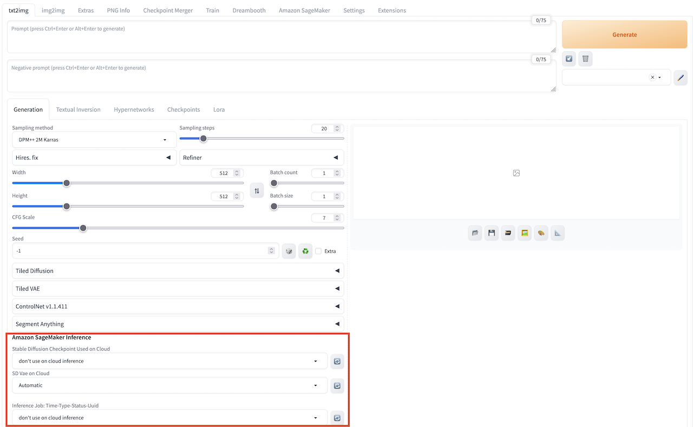

# txt2img Guide

You can open the **txt2img** tab to perform text-to-image inference using the combined functionality of the native region of txt2img and the newly added "Amazon SageMaker Inference" panel in the solution. This allows you to invoke cloud resources for txt2img inference tasks.

## Instructino for using txt2img

### General Inference Scenario

1. Navigate to **txt2img** tab, find **Amazon SageMaker Inference** panel. 

2. Enter the required parameters for inference. Similar to local inference, you can customize the inference parameters of the native **txt2img**, including model name (stable diffusion checkpoint, extra networks:Lora, Hypernetworks, Textural Inversion and VAE), prompts, negative prompts, sampling parameters, and inference parameters. For VAE model switch, navigate to **Settings** tab, select **Stable Diffusion** in the left panel, and then select VAE mdoel in **SD VAE (choose VAE model: Automatic = use one with same filename as checkpoint; None = use VAE from checkpoint).

   !!! Important "Notice" 
       The model files used in the inferece should be uploaded to the cloud before generate, which can be refrred to the introduction of chapter **Cloud Assets Management**

3. Select an endpoint for inference. Refresh and select an endpoint from **Select Cloud SageMaker Endpoint** dropdown list that is in the *InService* state. After select one *InService* endpoint, the button **Generate** will change to button **Generate on Clound**。

    !!! Important "Notice" 
        This field is mandatory. If you choose an endpoint that is in any other state or leave it empty, an error will occur when you click **Generate on Cloud** to initiate cloud-based inference.

4. Finish setting all the paramters, and then click **Generate on Cloud**.

5. Check inference result. Fresh and select the top option among **Inference Job: Time-Type-Status-Uuid** dropdown list. The **Output** section in the top-right area of the **txt2img** tab will display the results of the inference once completed, including the generated images, prompts, and inference parameters. Based on this, you can perform subsequent workflows such as clicking **Save** or **Send to img2img**.
> **Note：** The list is sorted in reverse chronological order based on the inference time, with the most recent inference task appearing at the top. Each record is named in the format of *inference time -> inference id*.

### Continuous Inference Scenarios
1. Following the **General Inference Scenario**, complete the parameter inputs and click **Generate on Cloud** to submit the initial inference task.
2. Wait for the appearance of a new **Inference ID**in the right-side "Output" section.
3. Once the new **Inference ID** appears, you can proceed to click **Generate on Cloud** again for the next inference task.

## Controlnet Guide

* ### Support Multicontrolnet
1. Navigate to **Settings** tab, select **ControlNet** in the left panel, and then set the number of controlNet unit in **Multi ControlNet: Max models amount (requires restart)**, and then restart the webui.

2. Naviaget to **txt2img**，if we set the number is 3, there will be 3 ControlNet Units in the **ControlNet** panel.

* ### Openpose use guide
1. Open ControlNet panel, choose **ControlNet Unit 0**, check **Enable**, select **openpose** from **Preprocessor**, and then upload am image.

2. Similar to local inference, you can customize the inference parameters of the native **ControlNet**. The controlnet model "**control_openpose-fp16.safetensors**" should be uploaded to the cloud before generate. 
3. Click **Generate on Cloud** after finished all parameters setting.

4. Refresh and select the top Inference Job from **Inference Job: Time-Type-Status-Uuid**, inference result will be displayed in **Output** section.