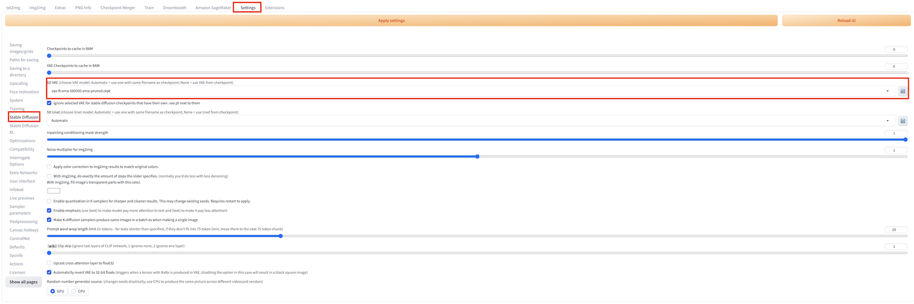

# 使用txt2img进行云上推理

您可以打开**txt2img**标签页，通过结合使用**txt2img**原生区域及解决方案新增面板**Amazon SageMaker Inference**，实现调用云上资源的**txt2img**推理工作。 

## txt2img的使用方法
### 通用场景

1. 进入**txt2img**标签页，找到**Amazon SageMaker Inference**面板。

2. 输入推理所需参数。同于本地推理，您可以按需编辑**txt2img**原生的推理参数，包括模型(stable diffusion checkpoint, extra networks:Lora,Hypernetworks, VAE等)，提示词，负提示词，取样参数，推理参数等。VAE模型切换需要点击**Settings**按钮进入设置面板，在左侧一栏选择Stable Diffusion, 右侧面板**SD VAE (choose VAE model: Automatic = use one with same filename as checkpoint; None = use VAE from checkpoint)**处右侧刷新选择要用的VAE模型完成VAE模型切换。

   !!! Important "提示" 
       选择的模型文件需要通过云上资源管理章节介绍的方式进行推理模型上传到云上，才能使用该模型进行云上推理

3. 选择推理节点。点击**Select Cloud SageMaker Endpoint**右侧的刷新按钮，选择一个处于**InService**状态的推理节点, 则会触发右上角**Generate**按钮变为**Generate on Clound**。

    !!! Important "提示" 
        此项为必选项。如果选择处于其他状态的推理节点，或者选择为空，点击**Generate on Cloud**开启云上推理功能时会报错。

4. 所有参数设置完成后，点击**Generate on Cloud**。
5. 查看推理结果。通过点击**Inference Job: Time-Type-Status-Uuid**右侧的刷新按钮进行下拉列表刷新，查看最上方的、符合推理提交时间戳的**Inference Job ID**。txt2img标签页右上方的**Output**区域会显示推理的结果，包括图片，提示词以及推理的参数等。在此基础上，可以点击**Save**或者**Send to img2img**等，进行后续工作流。
> **补充：** 列表按照推理时间倒序排列，即最近的推理任务排在最上方。每条记录的命名格式为**推理时间->推理状态（succeed/in progress/fail)->inference id**。

### 连续使用场景

1. 按**通用场景**使用流程，完成参数录入，并点击**Generate on Cloud**提交第一次推理任务。
2. 等待右侧**Output**部分出现了新的**inference id**。
3. 在新的**Inference Job ID**出现后，便可再次点击**Generate on Cloud**进行下一次推理。

## Controlnet的使用方法

### 支持多个controlnet同时启用
1. 点击**Settings**按钮进入设置面板，在左侧一栏选择ControlNet, 右侧面板**Multi ControlNet: Max models amount (requires restart)**处设置ConrolNet数量（1-10）,重新启动webui,Multi ControlNet生效。

2. 重新进入txt2img推理界面，ControlNet面板处则出现相同个数的ControlNet Unit，如下图同时启动三个ControlNet。

### openpose的使用方法
1. 打开ControlNet面板，点击ControlNet Unit 0勾选**Enable**，选择**Preprocessor**为**openpose**，同时上传图片。
 
    
2. 同于本地ControlNet推理，您可以按需编辑**ControlNet**原生的参数，其中Model处使用的模型需要提前传到S3，才能进行正常推理。
3. 点击**Generate on Cloud**。

4. 查看推理结果。通过点击**Inference Job: Time-Type-Status-Uuid**右侧的刷新按钮进行下拉列表刷新，查看最上方的、符合推理提交时间戳的Inference Job ID。

5. 后续操作。如需对推理图片保存或作进一步处理，可以点击**Save**或者**Send to img2img**等。
